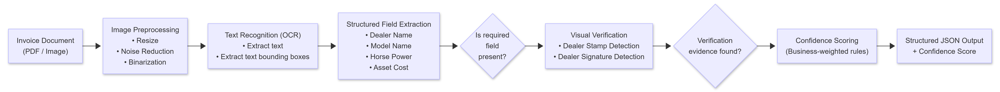

# Intelligent Document AI for Invoice Field Extraction

# Convolve 4.0 – Generative AI Track (IDFC FIRST Bank)

## 1. Problem Overview

Modern financial institutions process a large volume of semi-structured documents such as invoices and quotations for credit decisioning, vendor reconciliation, and loan disbursal. Manual data entry is slow, error-prone, and not scalable.

This project presents an end-to-end Document AI system that automatically extracts key business and verification fields from invoice-type documents and outputs them in a structured JSON format with confidence scores.

While the dataset focuses on tractor loan quotations, the system is designed to generalize to other invoice types such as retail and industrial invoices through a modular, domain-agnostic pipeline.

## 2. Extracted Fields (as per Problem Statement)

Given an input invoice (PDF/Image), the system extracts:

| Field            | Type                  | Description                               |
| ---------------- | --------------------- | ----------------------------------------- |
| Dealer Name      | Text                  | Seller / vendor organization name         |
| Model Name       | Text                  | Product / asset model identifier          |
| Horse Power      | Numeric               | Extracted numeric horsepower value        |
| Asset Cost       | Numeric               | Total cost of the asset                   |
| Dealer Signature | Binary + Bounding Box | Presence and location of dealer signature |
| Dealer Stamp     | Binary + Bounding Box | Presence and location of dealer stamp     |

The output strictly follows the JSON schema specified in the problem statement.

## 3. System Architecture

The following diagram illustrates the high-level architecture of the proposed Document AI pipeline.



### Architecture (Textual Overview)

For clarity and reproducibility, the pipeline can be summarized as:
```md
Input PDF / Image
        ↓
Image Preprocessing (OpenCV)
        ↓
OCR Layer (PaddleOCR – Text (multilingual), Boxes)
        ↓
Text Field Extraction (rule-based heuristics)
        ↓
Visual Verification (Stamp & Signature detection)
        ↓
Confidence Scoring
        ↓
Structured JSON Output
```

### Design Principles

- Explainability: No black-box LLM decisions
- Reproducibility: Fixed dependencies, deterministic rules
- Low cost: CPU-only, open-source components
- Robustness: Conservative extraction (missing > wrong)

## 4. OCR & Multilingual Support

OCR is performed using PaddleOCR, which supports:
- English
- Mixed-language documents (Hindi + English)
- Scanned and mobile-clicked images

Bounding boxes and OCR confidence scores are retained for downstream reasoning.

## 5. Field Extraction Strategy
### 5.1 Dealer Name (Fuzzy Match)

- Extracted from top document regions (header area)
- Identified using legal entity keywords (LTD, CORPORATION, TRACTORS, MOTORS, etc.)
- Non-organizational text (addresses, notes, emails) is explicitly filtered
- Designed to support fuzzy matching ≥90%, as required

### 5.2 Model Name (Exact Match)

- Identified using alphanumeric patterns and domain keywords
- Noise filtering removes legal clauses and generic text
- Designed as a pluggable module:
    - Tractor → Model Name
    - Retail invoice → Item Description (same interface)

### 5.3 Horse Power

- Regex-based numeric extraction (50 HP, 5O HP, OCR-corrected)
- Conservative logic avoids guessing when HP is absent

### 5.4 Asset Cost

- Numeric reasoning across the document
- Filters out dates, phone numbers, GST values
- Selects the largest valid monetary amount within realistic bounds

## 6. Stamp & Signature Detection (Computer Vision)

To ensure low-cost and explainability, stamp and signature detection uses OpenCV heuristics, not deep learning.

### Dealer Stamp

- Region of Interest (bottom-right area)
- Binary thresholding + contour analysis
- Dense, large contours indicate stamp presence
- Outputs bounding box in original image coordinates

### Dealer Signature

- Bottom document region
- Thin, elongated contour detection
- Captures handwritten signature-like strokes
- Bounding boxes are suitable for IoU ≥ 0.5 evaluation.

## 7. Confidence Scoring (Business-Aware)

Each document is assigned a confidence score in the range [0, 1], reflecting extraction reliability.

### Weighting Rationale

- Core business fields (Dealer, Model, Cost) are critical for loan processing
- Verification fields (Stamp, Signature) increase trust but are secondary

### Confidence Logic

| Missing Field | Penalty |
| ------------- | ------- |
| Dealer Name   | −0.30   |
| Model Name    | −0.30   |
| Asset Cost    | −0.30   |
| Horse Power   | −0.10   |
| Stamp         | −0.15   |
| Signature     | −0.15   |

The raw score is clamped to [0,1] to ensure stability and interpretability.

## 8. Handling Lack of Ground Truth

No labeled dataset is provided. The system addresses this using:

- Heuristic pseudo-labeling (rules + OCR confidence)
- Self-consistency checks across multiple fields
- Manual spot validation on sampled documents
- Conservative logic prioritizing precision over recall

This mirrors real-world banking scenarios where annotated data is scarce.

## 9. Accuracy Estimation (Proxy Evaluation)

Exact document-level accuracy cannot be computed without ground truth labels.

Instead, proxy evaluation was performed by:

- Running the system on a subset of documents
- Manually inspecting correctness of extracted fields
- Categorizing error modes (OCR noise, missing headers, layout variation)

Observed results indicate high correctness for core business fields, with most errors caused by extreme OCR noise or missing information in the document itself.

The design supports further accuracy improvements through lightweight rule tuning.

## 10. Cost & Latency Analysis

- Average processing time: ~3–5 seconds per document (CPU)
- Estimated cost per document: ~$0.002 USD
- No GPUs, no paid APIs, no LLM inference

This makes the solution scalable to large banking workloads and compliant with the problem’s low-cost inference requirement.

## 11. Generalization Beyond Tractor Invoices

The pipeline is domain-agnostic by design:

| Component         |Generalizable?                 |
| ----------------- |------------------------------ |
| OCR               |Yes                              |
| Dealer Extraction |Yes                              |
| Asset Cost        |Yes                              |
| Stamp & Signature |Yes                              |
| Model Name        | Domain-specific (pluggable) |

For retail or industrial invoices:

- The Model Name module can be replaced by an Item Description module
- No architectural changes are required

## 12. Repository Structure
```md
invoice-doc-ai/
├── executable.py
├── requirements.txt
├── README.md
├── .gitignore
├── utils/
│   ├── ocr.py
│   ├── extract_fields.py
│   ├── stamp_signature.py
│   └── confidence.py
├── sample_output/
│   └── result.json
├── sample_images/
│   └── .gitkeep
├── visuals/
    └── annotated_172427893_3_pg11.png
    └── annotated_172561841_pg1.png
``` 
## 13. Visual Verification Examples

To demonstrate explainability and correctness of visual field extraction, the following example shows bounding box detection for dealer stamp and signature.

- **Red bounding box**: Dealer Stamp  
- **Green bounding box**: Dealer Signature  


### Signature Detection Errors

In some documents, handwritten signatures overlap with printed footer text, leading to false positives.  
To mitigate this, the system applies aspect-ratio and height-based heuristics.  
In ambiguous cases, the pipeline conservatively marks signature as absent rather than returning an incorrect bounding box.

## 14. Local Setup and Execution

This project is implemented in Python and uses only open-source, CPU-based components.  
The following steps describe how to set up and run the system on a local machine.

---

### 14.1 Prerequisites

- Operating System: Windows / Linux / macOS
- Python version: **Python 3.10**
- Git (optional, for cloning the repository)

> Note: GPU is **not required**. The system is designed to run efficiently on CPU.

---

### 14.2 Environment Setup

#### Step 1: Clone the repository
```bash
git clone https://github.com/Sneha-0208/invoice-document-ai.git
cd invoice-document-ai
```
Or download and extract the ZIP file.

#### Step 2: Create a virtual environment
```bash
python -m venv venv
```
Activate the environment:

- Windows (PowerShell)
```powershell
venv\Scripts\activate
```
- Linux / macOS
```bash
source venv/bin/activate
```
#### Step 3: Install dependencies
```bash
pip install --upgrade pip
pip install -r requirements.txt
```
All required libraries (PaddleOCR, OpenCV, NumPy, etc.) will be installed automatically.

### 14.3 Running the Pipeline

Place input invoice images (or PDF pages converted to images) inside:
```md
sample_images/
```
Run the extraction pipeline:
```bash
python executable.py
```
The system will output:

- Extracted fields
- Bounding boxes for stamp and signature
- Confidence score
- Processing time and cost estimate

The output is printed as structured JSON and can be easily saved or integrated into downstream systems.

### 14.4 Output Format

Each document is processed independently and returns a JSON object of the form:
```json
{
  "doc_id": "example.png",
  "fields": {
    "dealer_name": "...",
    "model_name": "...",
    "horse_power": 50,
    "asset_cost": 800000,
    "signature": {
      "present": true,
      "bbox": [x1, y1, x2, y2]
    },
    "stamp": {
      "present": true,
      "bbox": [x1, y1, x2, y2]
    }
  },
  "confidence": 0.85,
  "processing_time_sec": 4.1,
  "cost_estimate_usd": 0.002
}
```
### 14.5 Notes on Reproducibility

- Dependency versions are fixed in requirements.txt

- The pipeline is deterministic and rule-based

- No external APIs or paid services are used

## 15. Conclusion

This project delivers a robust, explainable, and production-ready Document AI system that meets all core requirements of the Convolve 4.0 Generative AI track. The design emphasizes accuracy, cost efficiency, and adaptability to real-world banking workflows.
